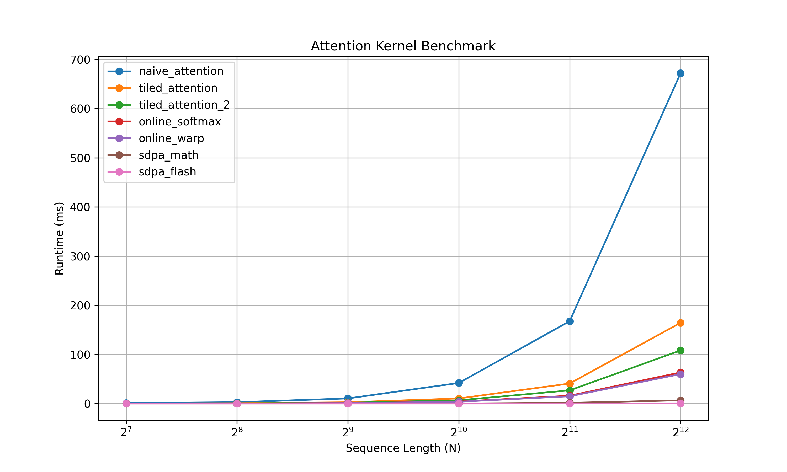
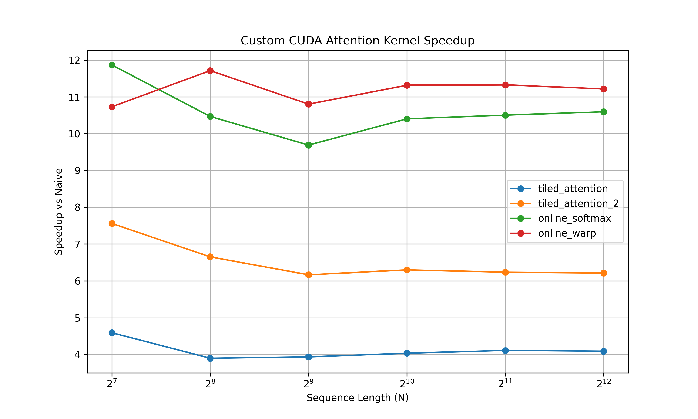

# FlashAttention — CUDA Kernel Optimization Study

A from-scratch CUDA implementation of scaled dot-product attention, progressively optimized from a naive baseline to a FlashAttention-style forward pass using shared memory tiling, online softmax, and warp-level reductions.

Built and profiled on an **RTX 4050 Mobile (6GB VRAM)**.

---

## Results

**11.2× speedup** over naive attention at sequence length N=4096, achieved through five optimization stages.


*Runtime vs sequence length : naive attention grows steeply (O(N²) memory). PyTorch (sdpa) appear nearly flat because they operate in FP16 on tensor cores with async memory pipelining, a fundamentally different execution model, not just a faster version of the same approach.*


*Speedup relative to naive across all sequence lengths*

| Kernel | N=1024 | N=4096 | Speedup vs Naive (N=4096) |
|---|---:|---:|---:|
| `naive_attention` | 41.90 ms | 672.27 ms | 1.0× |
| `tiled_attention` | 10.39 ms | 164.43 ms | 4.1× |
| `tiled_attention_2` | 6.65 ms | 108.17 ms | 6.2× |
| `online_softmax` | 4.03 ms | 63.44 ms | 10.6× |
| `online_warp` | 3.70 ms | 59.93 ms | **11.2×** |
| PyTorch `sdpa_math` | 0.19 ms | 6.55 ms | 102.6× |
| PyTorch `sdpa_flash` | 0.03 ms | 0.54 ms | 1257× |

> **Why is PyTorch so much faster?** Several compounding reasons:
> - **FP16 vs FP32**: PyTorch flash runs in half precision, FP16 has 2× the throughput of FP32 on CUDA cores, and on Ampere tensor cores the gap widens further (dedicated FP16 matrix units). This project uses FP32 deliberately: softmax involves `exp()` over raw dot products which can overflow or underflow easily in FP16 without careful scaling, getting correctness right in FP32 first was the priority.
> - **Tensor cores**: PyTorch uses `wmma`/MMA instructions that operate on 16×16 matrix tiles in hardware. These kernels use standard CUDA cores.
> - **Async pipelining**: Production FlashAttention overlaps memory transfers with computation using `cp.async` instructions. No such pipelining here. 
>
> This is not intended to be a production replacement for FlashAttention. The goal of the project is to understand and implement the core algorithmic ideas behind efficient attention kernels : shared-memory tiling, online softmax, and warp-level reductions, and map them directly onto GPU execution and memory hierarchies through hand-written CUDA kernels.

---

## Kernel Progression

### 1. Naive Attention
Direct CUDA translation of `softmax(QKᵀ / √d) · V`. Materializes the full N×N score matrix in HBM. Entirely memory-bandwidth bound, most time is spent on global memory round trips, not computation.

### 2. Tiled Attention
Stages Q/K/V tiles through shared memory. Q is loaded once per block; K and V are reused across threads. Eliminates redundant HBM reads. **4.1× speedup over naive.**

### 3. Tiled Attention v2
Restructured tile layout with better K/V reuse and improved occupancy. More aggressive staging reduces shared memory idle cycles. **6.2× speedup.**

### 4. Online Softmax
The key algorithmic change. Standard softmax requires the full score row before normalizing — this kernel streams through tiles instead, maintaining a running max `m` and normalization factor `l`. No attention matrix is ever written to global memory. **10.6× speedup.**

### 5. Online Warp (Final Kernel)
Replaces shared-memory tree reductions with warp shuffle instructions (`__shfl_xor_sync`). Threads exchange data directly within a warp — no shared memory round trips, fewer `__syncthreads()` calls, lower reduction latency. **11.2× speedup.**

---

## Online Softmax — Core Idea

A standard softmax implementation needs the full score row before normalization:

```text
m = max(scores)
l = sum(exp(scores - m))
output = exp(scores - m) / l
```

That means the entire attention score matrix must either be stored in memory or revisited multiple times.

Online softmax avoids this by processing the attention scores tile-by-tile while maintaining running statistics instead of materializing the full row.

For each tile:

```text
m_new = max(m_old, tile_max)

l = l * exp(m_old - m_new)
    + sum(exp(tile_scores - m_new))

o = o * exp(m_old - m_new)
    + tile_contribution
```

The important detail is the rescaling term:

```text
exp(m_old - m_new)
```

If a later tile contains a larger score, all previous contributions must be rescaled under the new maximum to preserve numerical correctness.

This allows attention to be computed in a streaming fashion:

- no full N×N score matrix
- no extra HBM round trips
- significantly lower memory traffic
- softmax fused directly into the attention computation

The explanation and intuition in this section were adapted from:
https://gordicaleksa.medium.com/eli5-flash-attention-5c44017022ad

## Nsight Compute Findings

Profiling across sequence lengths revealed:

- **Naive kernel**: bottlenecked by HBM bandwidth : L2 cache hit rate near zero at large N
- **Tiled kernels**: shared memory bandwidth becomes the new bottleneck, not HBM
- **Online softmax**: reduction overhead dominates : synchronization cost visible in warp stall metrics
- **Warp kernel**: occupancy improved, SM utilization improved, register pressure dropped, warp stalls reduced significantly
- Increasing tile size beyond a threshold hurt performance on the 4050's shared memory capacity - profiler data was essential to find the sweet spot

---

## Repository Structure

```
FlashAttention/
├── kernels/               # CUDA kernel implementations (.cu)
├── cpp_extensions/        # PyTorch C++ extension wrappers
├── benchmark/             # Benchmarking scripts and plots
├── tests/                 # Correctness verification, to run kernels manually
└── setup.py               # Build script
```

---

## Setup & Usage

```bash
# Build CUDA extensions
python setup.py build_ext

# Run benchmarks
python benchmark/benchmark.py

# Test correctness (kernel_id: 0=naive, 1=tiled, 2=tiled_2, 3=online_softmax, 4=online_warp)
python tests/test.py <kernel_id>
```

---

## Possible Next Steps

- FP16 / vectorized (`float4`) memory access
- Causal masking
- Backward pass
- Multi-head batching
- Tensor core (MMA) implementation